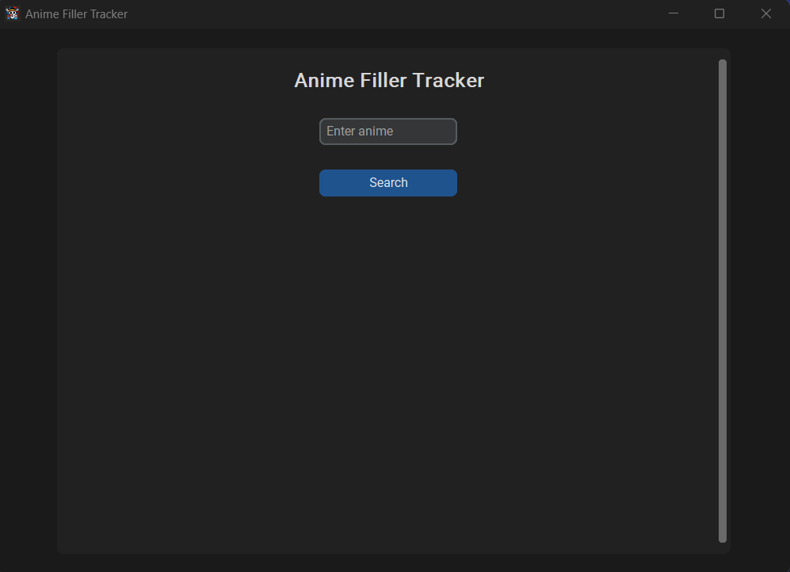
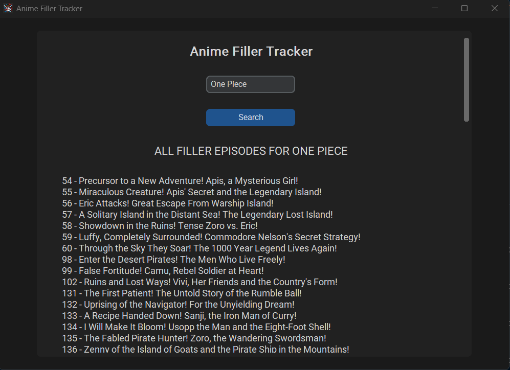
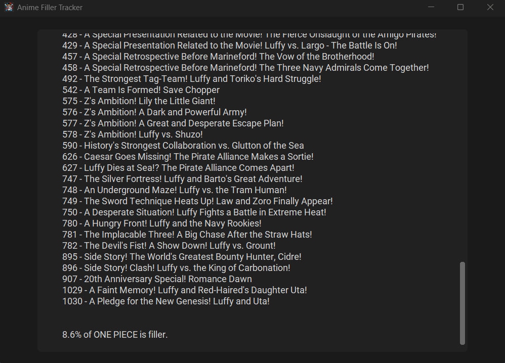
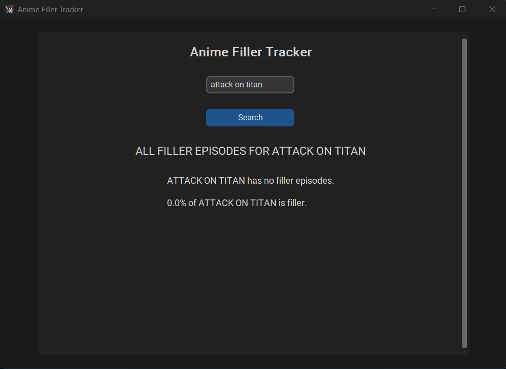
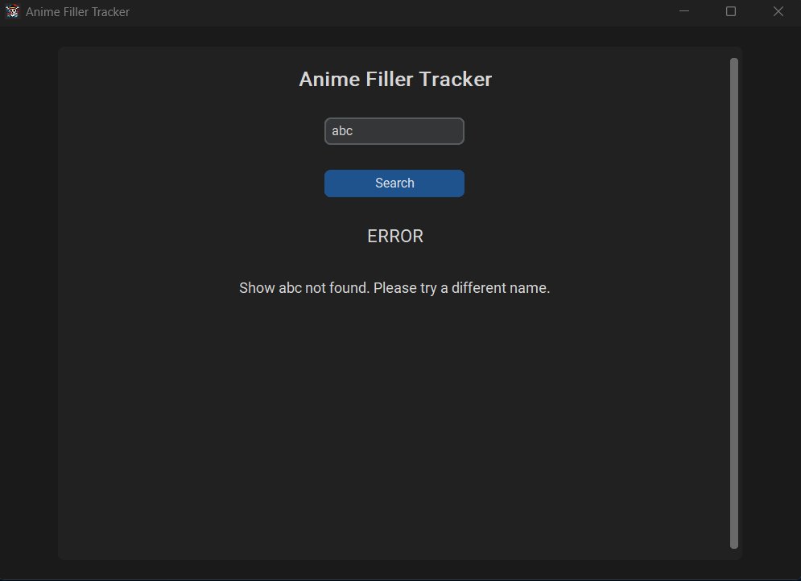

# Anime Filler Tracker

An application that tracks and displays all filler episodes of an anime series. Uses web scraping with BeautifulSoup for data collection and customtkinter to implement a simple graphical user interface (GUI).

A filler episode is an episode that contains content not present or canon in the source material, which is often manga for anime. The episodes are not relevant to the main storyline, but may provide additional backstory or development for certain side characters.



## Purpose

Anime Filler Tracker is an application designed to streamline the anime-watching experience for users. It allows users to search for any anime name and be able to view an up to date list of all filler episodes of the series, as well as the percentage of filler episodes in the anime. Users can seemlessly view an entire list of filler episodes and decide which episodes to skip or watch.

## Installation 
1. Clone Repository
     ```
     git clone https://github.com/ayaanyousaf/anime-filler-tracker.git
     ```
3. Change directory
     ```
     cd anime-filler-tracker
     ```
5. Install dependencies
     ```
     pip install beautifulsoup4
     pip install requests
     pip install customtkinter
     ```

7. Run application
     ```
     python filler_gui.py
     ```

## Usage 
1. Enter a valid name of an anime series in the search bar and click the search button to view results
<div style="display: flex; justify-content: space-between;">
  
  
</div>
<hr>

2. Example output shows the case where an anime series has <b>no filler episodes</b>

   
<hr>

3. Displays an error if the HTTP request fails, indicating the <b>show could not be found</b>

   
<hr>

## Features
* Displays all filler episode names and numbers for an anime series
* Displays the percentage of filler episodes in the anime

## Testing 
To run tests, ensure you have the pytest framework installed: 
```
pip install pytest
```
Then type the following command in your terminal: 
```
pytest test.py
```

## Technologies 
- Python
- BeautifulSoup (for web scraping animefillerlist.com)
- customtkinter (designing GUI)
- requests (making HTTP requests)

## License 
This software is licensed under the [MIT License](LICENSE).
